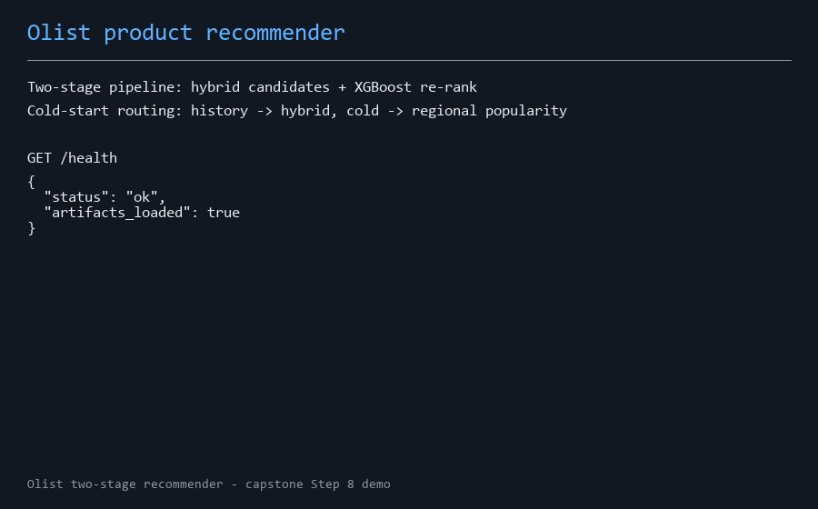

# eCommerce Product Recommender — Olist Marketplace

End-to-end machine learning capstone project: a two-stage product recommendation system built on the [Olist Brazilian eCommerce dataset](https://www.kaggle.com/datasets/olistbr/brazilian-ecommerce) (~100k real marketplace orders, 2016–2018).

> Capstone for the Post Graduate Diploma in Artificial Intelligence and Machine Learning (AIM/Emeritus) — Daniel Jethro Monzada.

## Problem

Olist is a marketplace that connects small Brazilian sellers to large storefronts. Roughly 97% of its customers never come back for a second order. This project builds a recommender that targets that gap: surface relevant products to each customer to lift repeat purchases and cross-sell, while giving long-tail sellers fair exposure.

**Task type:** recommendation, decomposed into two stages —

1. **Candidate generation** — popularity baseline, item-item collaborative filtering, content-based similarity, truncated-SVD matrix factorization, and a hybrid blend.
2. **Conversion ranking** — a supervised classifier (Logistic Regression / Random Forest / XGBoost) that scores candidate (customer, product) pairs using engineered behavioural, product, and pair features.

**Technical metrics:** HitRate@10, NDCG@10, catalogue coverage (stage 1); ROC-AUC, PR-AUC, F1 (stage 2).
**Fairness:** recommendation-quality parity across Brazilian regions, seller-exposure equity, popularity-bias measurement — with a mitigation re-ranker and a measured fairness/accuracy trade-off.

## Results

Candidate generation (leave-last-order-out over 1,949 repeat buyers; full analysis with CIs in `reports/final_report.md`):

| Model | HitRate@10 | NDCG@10 | Coverage |
|-------|-----------|---------|----------|
| Popularity baseline | 0.031 | 0.014 | 0.000 |
| Item-item CF | 0.055 | 0.041 | 0.042 |
| Content-based | 0.171 | 0.141 | 0.377 |
| Truncated SVD (k=256) | 0.054 | 0.047 | 0.019 |
| **Hybrid (w=0.25)** | **0.203** | **0.151** | 0.371 |

End-to-end on 18,390 holdout customers: the two-stage pipeline (hybrid candidates + XGBoost re-rank) beats Stage-1 order by a paired per-customer difference of **+0.0024 [+0.0008, +0.0041]** HitRate@10 — small but real (+20% relative). The fairness audit, mitigation trade-offs, and their honest caveats live in the report's Step 5.

## Serving

```bash
uvicorn app.main:app --port 8000    # then open http://localhost:8000/
```

`GET /recommend/{customer_unique_id}?k=10` serves the evaluated pipeline with cold-start routing; add `&explain=true` for LLM-generated "why you're seeing this" blurbs on the top items (grounded in the ranker's SHAP attributions, served from a committed cache — live generation only when `ANTHROPIC_API_KEY` is configured). `docs/deployment_guide.md` covers Docker, monitoring, and rollback.

**Demo video** (recommendation routes + LLM explanations): [`docs/media/demo.mp4`](docs/media/demo.mp4)



## Presentations

Two decks summarise the project (Step 6): a [technical deck](presentations/technical_deck.slides.html) for peers (reveal.js export of `notebooks/05_technical_slides.ipynb`; open in a browser — reveal.js loads from a CDN, so it needs internet) and a [business deck](presentations/business_deck.pptx) for a non-technical audience. Regenerate with:

```bash
jupyter nbconvert --to slides notebooks/05_technical_slides.ipynb --output-dir presentations --output technical_deck --embed-images
python presentations/build_business_deck.py
```

## Repository layout

```
configs/          # YAML experiment configs
data/raw/         # Olist source CSVs (see data/README.md for licence + download)
data/processed/   # derived artefacts (regenerated; committed: zip-prefix centroid lookup)
docs/             # data dictionary, deployment guide, LLM prompts & outputs (docs/llm/), demo media
notebooks/        # 01 data overview · 02 EDA & features · 03 modeling · 04 explainability & fairness · 05 technical slides
src/              # reusable pipeline code (data, features, models, evaluation, fairness, recommend)
models/           # saved model artefacts + per-run metrics
reports/          # final report + figures
presentations/    # technical + business slide decks
app/              # FastAPI recommendation service + demo page
tests/            # pytest suite
```

## Quickstart

```bash
py -3.11 -m venv .venv
.venv\Scripts\activate
pip install -r requirements.txt

# data: see data/README.md (Kaggle download instructions)

# run the notebooks in order, or serve the trained model:
uvicorn app.main:app --reload
```

## AI assistance

Generative AI (Anthropic's Claude) was used in this project as a development assistant — code scaffolding, review, and documentation drafting — and as a project feature (LLM-generated recommendation explanations and an LLM-drafted data dictionary, both documented in the final report's *Use of Generative AI* section, with prompts, raw outputs, and generated examples committed under `docs/llm/`). All analysis decisions, results, and final content were verified and are owned by the author.

## Licence

Code: MIT (see `LICENSE`). Data: Olist dataset, CC BY-NC-SA 4.0 — see `data/README.md`.
