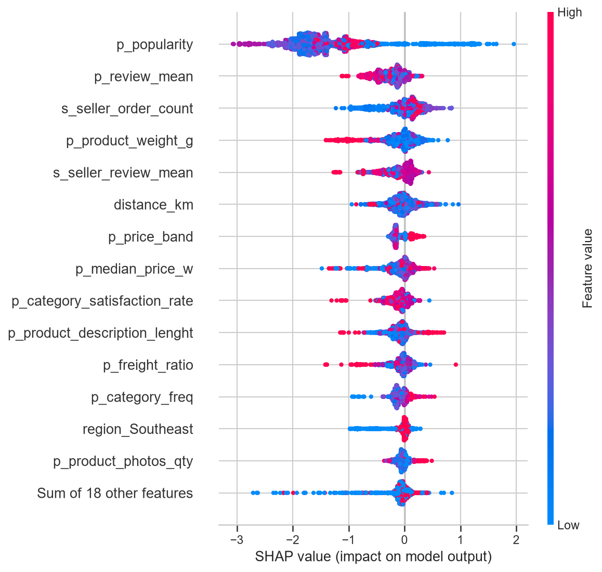
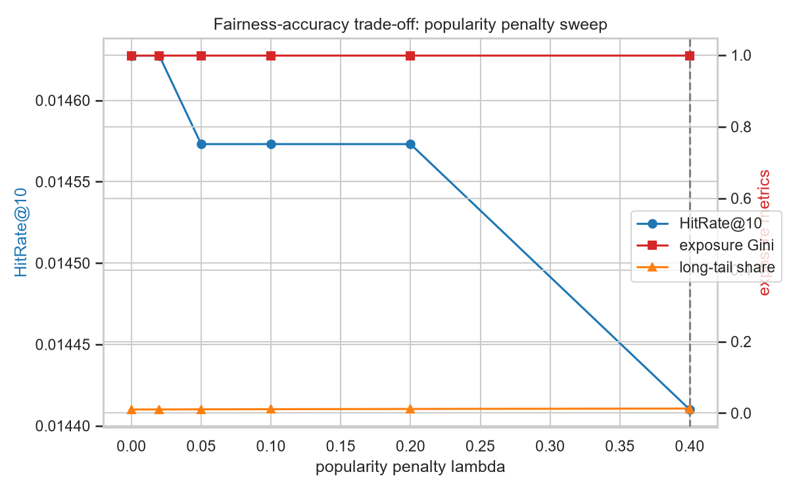
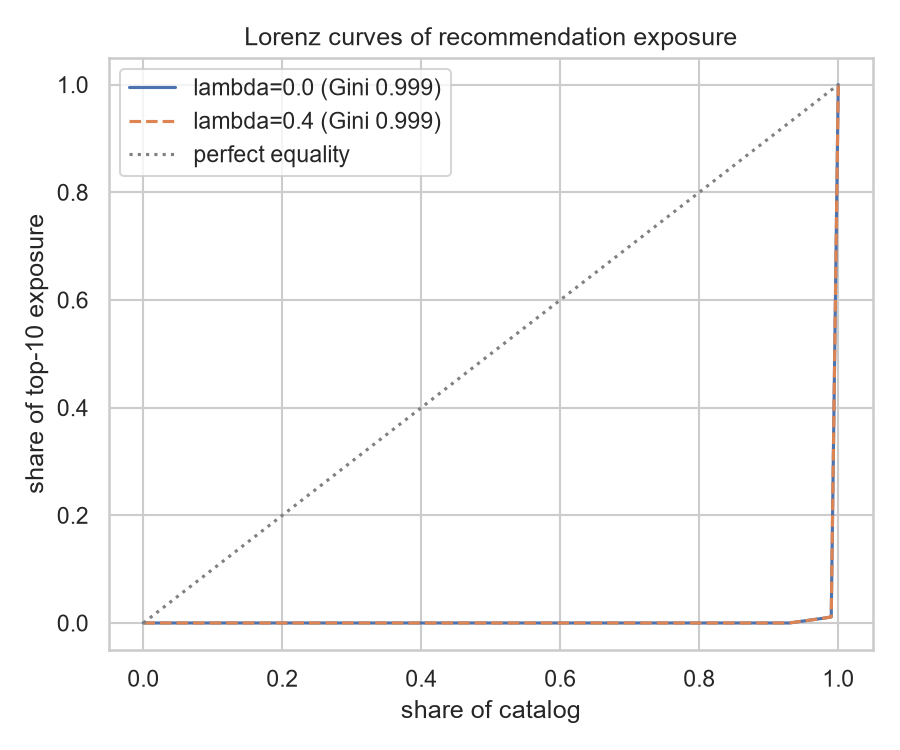

# Product Recommendation for the Olist Marketplace — Capstone Final Report

**Daniel Jethro Monzada** — Post Graduate Diploma in Artificial Intelligence and Machine Learning (AIM/Emeritus, June 2025 cohort)

*(Report written incrementally as each step lands. Steps 3–9 sections follow as the work completes.)*

---

## Step 1: Problem Understanding & Framing

Olist is a Brazilian marketplace that connects small sellers to big storefronts. When I profiled the data, one number ended up shaping the whole project: 96.9% of Olist's 96,096 customers have placed exactly one order, ever. That's a brutal retention picture, and it means the business question isn't "how do we rank products a bit better" — it's whether a recommender can pull more customers into a second purchase at all, and whether it can widen what buyers see beyond the same bestsellers. There's a seller-side angle too. Olist's pitch to small merchants is exposure, so a recommender that only ever surfaces the popular stuff quietly breaks the marketplace's own value proposition.

Task-wise this is a recommendation problem, but I've deliberately decomposed it into two stages, because that's how production recommenders actually work and because each stage answers a different question. Stage one is candidate generation: given a customer, produce a shortlist of plausible products using item-item collaborative filtering, content similarity, matrix factorization, and a popularity baseline that I fully expect to be hard to beat on data this sparse. Stage two is a supervised ranker, a binary classifier scoring "will this (customer, product) pair convert as a delivered purchase" over engineered features. I did consider simpler framings. Plain classification or customer clustering would've been easier to build, but neither delivers a ranked product list, which is the thing a marketplace actually needs. The two-stage split also has a practical modelling payoff: the ranker is a feature-based model, which is where explainability tools like SHAP genuinely work.

For candidate generation I'm tracking HitRate and Recall at K = 10, 50 and 100, plus NDCG@10, MRR and catalogue coverage. Bootstrap confidence intervals on all of them. Hit rates over a 32,951-product catalogue will be tiny numbers, and I don't want to declare a winner based on noise. The ranker gets ROC-AUC, PR-AUC and F1. The caveat: those are computed against sampled negatives, so they compare rankers against each other and say nothing absolute. The decision-grade number is neither family alone; it's the end-to-end table showing whether the full two-stage pipeline beats candidate generation on HitRate@10 and NDCG@10 for held-out purchases.

On business KPIs, each cohort gets one number with a baseline taken from the profiling run. For the roughly 3% of customers with purchase history, the KPI is repeat-purchase rate, currently 3.12% (2,997 of 96,096 customers), and the offline proxy is the pipeline's HitRate@10 uplift over the popularity baseline on held-out repeat purchases. For the single-purchase majority the honest target isn't personalisation, it's first-purchase cross-sell, which I'll proxy with category-level HitRate@10 on first orders versus popularity. Seller-side exposure equity gets measured directly: the share of top-10 recommendation slots going to products outside the top sales decile. All three are offline proxies; confirming real uplift would need an A/B test, which an offline capstone can't run.

## Step 2: Data Collection & Understanding

I'm using the Brazilian E-Commerce Public Dataset by Olist ([kaggle.com/datasets/olistbr/brazilian-ecommerce](https://www.kaggle.com/datasets/olistbr/brazilian-ecommerce), CC BY-NC-SA 4.0): 99,441 real anonymised orders from 2016–2018 across nine relational tables covering orders, order items, customers, products, sellers, reviews, payments, geolocation, and a Portuguese-to-English category translation. I picked it over synthetic or ratings-style datasets because it's genuinely transactional. Actual prices, freight costs, delivery dates and 1-to-5 review scores give the feature engineering something to chew on. The trade-off I accepted going in: no customer demographics (which reshapes the fairness audit, more on that in Step 5) and extreme interaction sparsity.

The profiling notebook (`notebooks/01_data_overview.ipynb`) drove what I'd call the most important decision in the project: the evaluation window dates. Olist's monthly volume tells a clear story. A tiny pilot in late 2016 (329 orders, with November 2016 missing entirely), steady growth through 2017, a plateau around 6–7k orders a month in 2018, and then a cliff after August 2018 where volume collapses to 16 and then 4 orders. Everything outside 2017-01 to 2018-08 is unusable. The three-window scheme is pinned to those dates in `configs/windows.yaml`: features from 2017-01 to 2018-02, ranker training labels from 2018-03 to 2018-05, holdout from 2018-06 to 2018-08. Every aggregate feature downstream gets computed strictly inside the feature window.

The tables themselves are in decent shape, but not spotless, and a few quirks matter. `order_items` has one row per physical unit, so its 112,650 rows collapse to 101,987 unique customer–product pairs; anything building an interaction matrix has to dedupe first. The reviews table caught me out. `review_id` looks like a primary key but isn't: 789 values appear more than once (814 duplicate rows) and 547 orders carry more than one review. I keep only the latest review per order. Missingness looks interpretable, not alarming: 88% of reviews have no title and 59% no message because most customers simply don't write text, and the 3% of orders missing a delivery date are largely the undelivered ones. Prices are heavy-tailed. The median item costs about R$75 while the p99 sits near R$890 and the max at R$6,735, which is why I'll winsorise price-derived features later rather than let a handful of luxury items stretch every scale. Review scores skew happy: 77.1% are 4 or 5. And 97.0% of orders reached `delivered` status, so filtering to delivered orders costs almost nothing. Geographically the dataset is lopsided, with 68.6% of customer records in the Southeast and just 1.9% in the North, which directly triggers the minimum-group-size rules I set for the fairness audit. A quick semantic pass over the columns (the notebook prints a per-table breakdown) shows mostly ids, categoricals and timestamps; the numeric signal concentrates in order items (price, freight) and product attributes (weight, dimensions), and free text exists only in review comments.

The full data dictionary lives in [`docs/data_dictionary.md`](../docs/data_dictionary.md): every column across all nine files with types, missingness, units and allowed values. I'll be upfront about how it was made, since it doubles as my first Step 9 deliverable. I had Claude draft it from schema profiles computed directly from the CSVs (`src/llm_docs.py`, with the prompt and raw output preserved in `docs/llm/`), then verified it by hand against the data. The draft was honestly better than I expected, but the verification wasn't a formality — it confidently called `review_id` "unique," which is exactly the kind of plausible-sounding error you only catch by checking. That catch is now a documented correction in the dictionary itself, and the uniqueness check is printed in the notebook's output so the number is reproducible.

## Step 3: Data Preprocessing, Applied EDA & Feature Engineering

All the cleaning and feature logic lives in `src/features.py` with `notebooks/02_eda_feature_engineering.ipynb` driving it, and every rule prints what it dropped or imputed. Filtering to delivered orders removes 2,963 of 99,441. The review dedupe (latest answer per order) removes 551 rows. Collapsing `order_items`' unit rows gives 102,425 order lines, and the product table needed 610 missing categories set to `unknown` plus 1,838 attribute values median-imputed. None of it silently changes the data, which was the point of returning the counts from every function. The window discipline from Step 2 is enforced here, and it turned out to need one rule I hadn't planned: a feature-window *order* can carry a review written after the cutoff. 3,805 reviews (6.7% of those joined to feature-window orders) were created past the cutoff, some well into the label window, so every review-based aggregate filters on `review_creation_date` and the notebook's audit cell now asserts both purchase and review-creation timestamps. Removing them nudged the average review given from 4.13 up to 4.17, because late reviews skew negative. I caught this in review after first shipping it wrong, which is a decent argument for auditing every timestamp column rather than just the obvious one.

The feature set covers three levels. Customers get RFM (recency, frequency, monetary), spend profile, average review given, installment habits and a preferred category. On the product side it's feature-window popularity, winsorised median price, freight-to-price ratio, review mean, a price band and the physical attributes, while sellers just carry volume and review reputation. Pair features are where the domain thinking sits: category match, price delta against the customer's median spend, a same-state flag, and a customer-to-seller haversine distance computed from the zip-prefix centroid lookup. Geography is *not* window-filtered, and that's deliberate — a customer's address is known at serving time, and window-filtering it would have thrown away the distance feature for the 98% of customers without purchase history. Cold-start fills are pinned to feature-window statistics (max recency 424 days, review mean 4.17, median customer-seller distance 453 km) so a pair's features don't depend on which batch it happens to be scored in. I also had to reinterpret one planned feature. The plan called for "category conversion rate," but Olist has no view or impression data, so conversion is unobservable; I substituted category satisfaction rate (share of the category's reviews at 4+), which is measurable and captures a similar quality signal.

The EDA backs the feature choices with numbers I found genuinely convincing. Median delivery time is 9 days on 5-star orders and 16 days on 1-star ones, and the 8% of reviewed orders that arrive late average 2.57 stars against 4.29 for on-time. That single contrast justifies every freight and distance feature in the set. Repeat buyers (2.92% of feature-window customers) spend more in total (R$255 vs R$136) but less per order, and lean harder on installments. Category demand isn't geographically uniform either; bed_bath_table's share swings 9.4 percentage points between regions within the feature window, which matters later because a popularity-only recommender would push the Southeast's taste onto everyone. Prices needed taming: the p99 winsorisation cap lands at R$1,102 and touches 205 products, about 1%.

The correlation heatmap over the engineered features mostly shows what you'd expect — monetary and average order value at 0.94, spend measures moving together — but its most useful lesson is a warning. The strongest correlations in the matrix (recency × has_history at −0.94, frequency × has_history at 0.86) are structural artefacts of the cold-start fills, not behaviour: when 98% of pairs share the same fill values, the fills correlate with the indicator by construction. I'll need to keep that in mind when reading feature importances and SHAP values later, since "importance" on a fill-dominated feature is really importance of being cold.

For the selection pass I assembled a preliminary ranking task: 21,260 label-window purchases as positives, uniform-random negatives at 1:4, splits grouped by customer. The cold-start number came out even starker than the Step 1 profiling suggested — only 2.09% of these pairs belong to a customer with feature-window history. The consequences show up immediately in the embedded selection. The L1 path zeroes 13 of 30 features at C=0.01, XGBoost's gain ranking puts product popularity at 0.41 with nothing else above 0.06, and the drop set is dominated by the six customer behavioural features that are cold for 98% of pairs. Picking C deserves a note, because the obvious rule gives a strange answer: C=0.001 actually has the best validation AUC (0.7334), but it collapses the model to four popularity-dominated features, stranding the domain features I expect to matter once hard negatives exist. I went with C=0.01 as the sparsest setting that keeps every feature family represented, and since C was chosen on the same validation set as the check below, I treat this whole pass as a screen. Retraining after the drop moved logistic regression from 0.7240 to 0.7244 AUC and XGBoost from 0.8123 to 0.8146, so the removed features were dead weight at best. One caveat: with random negatives this task is popularity-easy, so the selection stays provisional until notebook 03 re-runs it with hard negatives from the candidate generators.

Dimensionality reduction rounds out the step. PCA on the 13 standardised product features needs 10 components to reach 90% variance, so the feature set isn't carrying much redundancy — good news for the trees, and a sign that dropping components would actually cost information. The UMAP projection of the same space (8,000-product sample) still shows visible category clustering, which is exactly the structure the content-based candidate generator will lean on. For encoding, I one-hot encoded the five regions, frequency-encoded the 71 categories, and put a StandardScaler inside the linear pipelines only, since tree splits don't care about monotone rescaling.

## Step 4: Model Implementation & Comparison

Five candidate generators went head to head under the leave-last-order-out protocol: each of the 2,789 repeat buyers' last orders held out, Stage-1 artefacts fitted on the remaining 96,883 usable-range purchases, 840 users reserved for tuning the SVD rank and hybrid weight, and the untouched 1,949 producing the comparison table. Since hit rates over a 32,951-product catalogue are tiny numbers, every headline metric carries a bootstrapped 95% CI, and where two models were scored on the same users I also computed the paired per-user difference, which is far more powerful than eyeballing two overlapping intervals. The hybrid at w=0.25 tops HitRate@10 with 0.203 [0.184, 0.221] against content-based at 0.171, and the paired difference of +0.032 [+0.022, +0.042] makes that a decisive win, not a graze. It's also ahead deeper in the list (hit@50 0.241 vs 0.209, hit@100 0.260 vs 0.231, NDCG@10 0.151 vs 0.141) with comparable coverage (0.371 vs 0.377). Item-item CF (0.055), SVD (0.054) and popularity (0.031) trail far behind. Worth admitting about the protocol itself: leave-one-out trades temporal strictness for evaluation-set size, since artefacts see purchases that postdate some users' held-out orders. The temporally clean numbers are the end-to-end table below, which is the decision table anyway. And the hybrid weight is a coarse choice, not a tuned claim — the validation spread across w was 0.0036 on 840 users, well within noise.

Repurchase drives the table. 69% of content's hits and 62% of the hybrid's are products the customer had already bought, which the seen-item policy allows on purpose and the table reports in its own column. For repeat buyers, "you'll buy again what you bought before" is the single strongest signal in this dataset, and it's also why popularity wasn't the unbeatable baseline the recommender literature warns about — popularity can't exploit that channel. On the category-level view (a 71-way space with workable base rates), CF actually leads at 0.55; it's better at guessing the *kind* of thing you'll buy than the exact product. SVD improves with rank but stays far below content and hybrid at every rank tried, topping out at 0.054 with k=256, itself at the edge of the swept grid. I didn't chase larger ranks for a model that isn't a contender. Olist's basket structure (1.04 distinct products per delivered order) leaves item-item CF with only 8,710 nonzero similarity pairs, which also kills the ranker's co-purchase feature: `cf_signal` is positive for 0.1% of training positives, and the sanity plot shows that outright. The feature I designed as the creativity hook is, on this dataset, nearly dead. I kept it and flagged it; the models mostly route around it anyway.

The ranker task uses the pinned protocol — label-window purchases as training positives, holdout-window purchases for evaluation, four negatives per positive, half from the customer's own Stage-1 candidate list and half uniform random. All three models were tuned with GroupKFold by customer from the grids in `configs/models.yaml`, and every run went to MLflow. XGBoost and random forest are effectively tied on the holdout (AUC 0.864 vs 0.865, PR-AUC 0.614 vs 0.619), both clearly ahead of logistic regression at 0.785. The random forest pays for its fit with a 0.945 training AUC, an overfitting gap I'll return to in Step 5. Classification thresholds come from out-of-fold predictions rather than training-fit probabilities, because the trees' training probabilities are optimistically separated and would bias their thresholds; with the honest thresholds, F1 lands at 0.578 for XGBoost, 0.569 for RF and 0.475 for LR. The standing caveat applies: these numbers compare rankers against each other under one sampling scheme, not in absolute terms.

The end-to-end table is where the pipeline decision actually gets made, because it's the only place candidate generation and re-ranking meet on one metric. For all 18,390 holdout customers: route (98.5% cold to regional popularity, 1.5% warm to hybrid top-50), re-rank with each model, keep ten, score against what they really bought. Re-ranking with XGBoost gives the best overall HitRate@10 at 0.0146 vs 0.0122 for Stage-1 order alone, and the paired per-customer difference of +0.0024 [+0.0008, +0.0041] means the +20% relative lift is small but real. Logistic regression re-ranking actively destroys value (0.0061), a concrete demonstration that a weak ranker is worse than no ranker. The most interesting wrinkle is the warm cohort. For the 277 customers with history, the raw hybrid ordering looks better than XGBoost re-ranking (0.0578 [0.033, 0.087] vs 0.0325 [0.014, 0.054]), but those intervals overlap heavily; at roughly 16 hits vs 9, the comparison is directional and underpowered. The tempting move is to re-rank only the cold route, but choosing that after seeing this table would be fitting to my own evaluation, so it goes in the future-work list with a requirement of fresh validation. The final pipeline is hybrid candidates plus XGBoost re-ranking, with the warm-cohort caveat up front.

For reproducibility: seeds are fixed at 42 throughout, the chosen configuration is written to `models/chosen_config.yaml`, all metrics land in `models/metrics.json`, artefacts (similarity matrix, content matrix, feature-window SVD factors, popularity vector, the three rankers) are saved under `models/` (the random forest squeaked under the repo size limit at 53 MB compressed), and every model run is logged to MLflow's local store. I considered a neural recommender (NCF-style) and decided against it. With 1.04 products per order and a repurchase-dominated signal, the data can't feed a model whose whole advantage is learning interaction structure — the SVD result is the empirical version of that argument, and I'd defend that reasoning over any reflexive "deep learning is better."

## Step 5: Critical Thinking, Ethical AI & Bias Auditing

Everything in this step runs on the population that actually matters: each holdout customer's Stage-1 candidate list, 919,500 pairs from 18,390 customers, scored by the chosen XGBoost ranker with the decision rule ŷ = 1 iff score ≥ τ = 0.272, the threshold fixed out-of-fold back in Step 4. I refused to audit on per-user random negatives for a reason worth spelling out: a fixed sampling ratio forces every region's base rate to that ratio, which makes demographic parity trivially and meaninglessly "fair." On the real candidate lists, regional base rates differ (0.0005 in the South to 0.0009 in the Northeast), and every fairness table below prints them alongside its metrics.

The explainability stack starts global. SHAP's beeswarm puts product popularity far ahead of everything else (mean |SHAP| 1.49 against 0.26 for product review mean), with seller volume, product weight and distance filling out the top ten. The direction is the interesting part. Within a candidate list, high popularity pushes scores *down*, because the hard negatives were themselves drawn from popular candidate lists, so the model learned "popular but not purchased" as its dominant negative pattern. That one insight ends up explaining the mitigation failure below, which is the best argument I can make for doing explainability before intervening. Two local waterfalls show the model reasoning about individuals: a warm customer's top candidate scores 0.864, driven up by their purchase history features, while a cold customer's best regional-popularity candidate manages 0.327 with the cold-fill values doing most of the talking. LIME on the same two cases agrees with SHAP's top features (popularity, cf_signal, category match, seller volume), which is reassuring given LIME's local-perturbation approach couldn't be more different; the PDP/ICE panel adds that the popularity effect is monotone-ish while price delta is nearly flat, and the Step 3 warning applies throughout — importance on a cold-fill-dominated feature is partly importance of being cold.

On limitations, the three the rubric names each have a concrete face here. Imbalance: the ranker's training task is 20% positive by construction, and every AUC/PR-AUC/F1 I report is relative to that sampling design, a caveat that has followed the numbers since Step 4. Leakage: the three-window protocol is the defence, and it wasn't hypothetical — the review-creation leak I caught and fixed in Step 3 (6.7% of feature-window orders carried post-cutoff reviews) is exactly the failure mode the audit cells now assert against. Overfitting: the random forest's train AUC of 0.945 against 0.865 on holdout is the cautionary exhibit, XGBoost's 0.925 gap is smaller, and what discipline exists comes from depth 6, subsampled columns and early stopping-style tuning rather than wishful thinking. Beyond the named three: the popularity feedback loop. A deployed recommender that serves 98.5% of customers from popularity lists will reinforce the very concentration the exposure audit measures, which is why the mitigation work below matters beyond a rubric checkbox.

Now the audit itself. Olist has no gender, race, or age, and I'd rather be explicit about each than wave at "no demographics." Gender: not collected, and inferring it from first names (a common hack) would inject its own error and an ethical problem worse than the one it solves. Race: not collected, not inferable, and in the Brazilian context any proxy attempt would be irresponsible. Age: likewise absent. What the data does carry is geography, and in Brazil geography is a defensible socioeconomic proxy: by IBGE's PNAD Contínua (2018), mean household income per capita runs from about R$815/month in the Northeast and R$886 in the North to R$1,502–1,554 in the Center-West, Southeast and South — roughly a factor of 1.9 between the poorest and richest regions. My customer base skews hard toward the rich end (68.7% Southeast, 1.9% North). The proxy's own weakness gets named too: region-level income says nothing about any individual customer (the ecological fallacy), so this audit speaks about group-level service quality, not individuals.

The five-region table, with n and bootstrap CIs everywhere and suppression below the pre-registered thresholds: TPR at τ ranges from 0.222 [0.139, 0.319] in the Northeast down to 0.028 [0.014, 0.045] in the Southeast, a gap of 0.194; North, with only 10 positives, is suppressed rather than reported as noise, and the pre-registered N+NE merge gives a gap of 0.179. Per-region AUC runs 0.825 (NE) to 0.679 (CW). Demographic parity difference (0.018) and disparate impact ratio (0.294) are reported descriptively, with the standing caveat that selection rates ride on genuinely different base rates. The finding that surprised me: the disparity *favours* the lower-income Northeast, and it persists in the final-list audit (hit@10 of 0.031 for NE customers against 0.010–0.014 everywhere else). My best reading is that regional popularity lists match Northeastern demand more tightly, but whatever the mechanism, "the poor region gets better recommendations" is not the disparity direction anyone would have assumed without measuring — which is rather the point of measuring.

Two more checks stress-test the audit. Fairness through unawareness fails on cue: retraining the same XGBoost without the geography-derived features costs accuracy (candidate-population AUC 0.723 → 0.713) and *widens* the TPR gap to 0.292, because freight and price encode geography whether I include it or not. And the fairlearn ThresholdOptimizer, fitted for TPR parity on the training window, didn't transfer: the holdout gap moved from 0.194 to 0.260 on point estimates that sit inside the groups' wide CIs. I'm reporting that as an honest negative — post-processing parity constraints tuned on one window don't necessarily survive a temporal shift and a few dozen positives per group.

The provider side is where the numbers get dramatic. The unmitigated pipeline's top-10 lists have an exposure Gini of 0.9986, touch 7.1% of the catalogue, and give small sellers (below-median volume, 5.9% of products) just 0.02% of slots. The λ-penalty sweep then produced my favourite null result of the project: at every penalty strength, Gini doesn't move. The reason is structural — cold-route candidates are the regional top-50, all head items, so no within-list re-ranking can reach the tail. The audit doesn't just measure the bias, it locates it: exposure concentration is decided at candidate generation. The matched mitigation therefore went upstream, reserving 15 of 50 cold-route candidate slots for exploration items from regional ranks 51–500. It backfired spectacularly, costing 80% of hits, and the SHAP sign story from the top of this section explains why: hand the ranker tail candidates and its anti-popularity gradient promotes them wholesale. The mitigation that survives the diagnosis injects exploration *after* ranking — keep the re-ranked top-7, reserve three slots for seeded regional exploration items. That one is a trade-off a marketplace can actually price: hit@10 falls 13.8% relative (0.0146 → 0.0126) while coverage rises from 7.1% to 10.3%, long-tail share doubles, small-seller exposure quintuples, and Gini eases to 0.9921.

Proposed but not implemented, for the future-work list: per-group serving thresholds validated on a fresh window, richer exploration policies (bandit-style rather than uniform sampling), and re-checking the region gap once more holdout data accumulates, since most of the group cells here are running on double-digit positive counts. Everything above — tables, CIs, mitigation deltas — is persisted in `models/fairness_metrics.json`.
