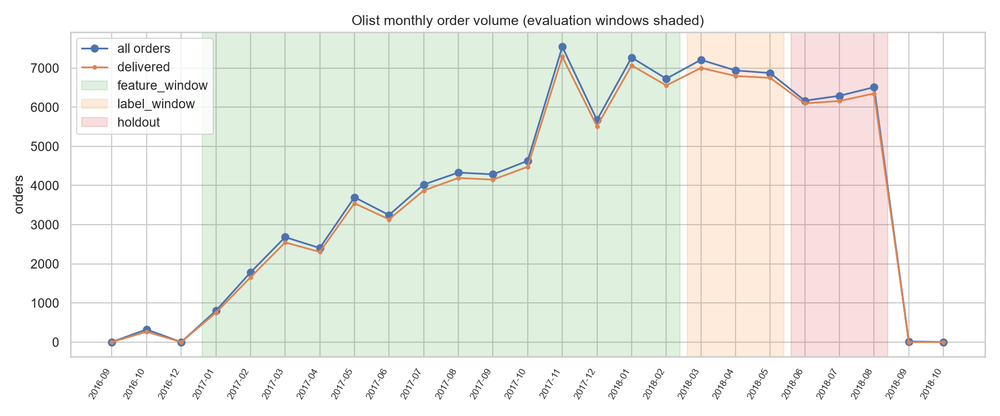
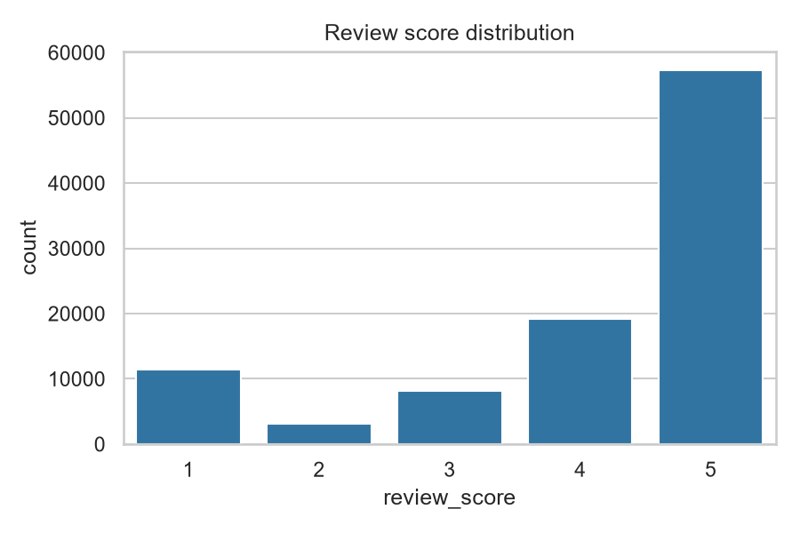
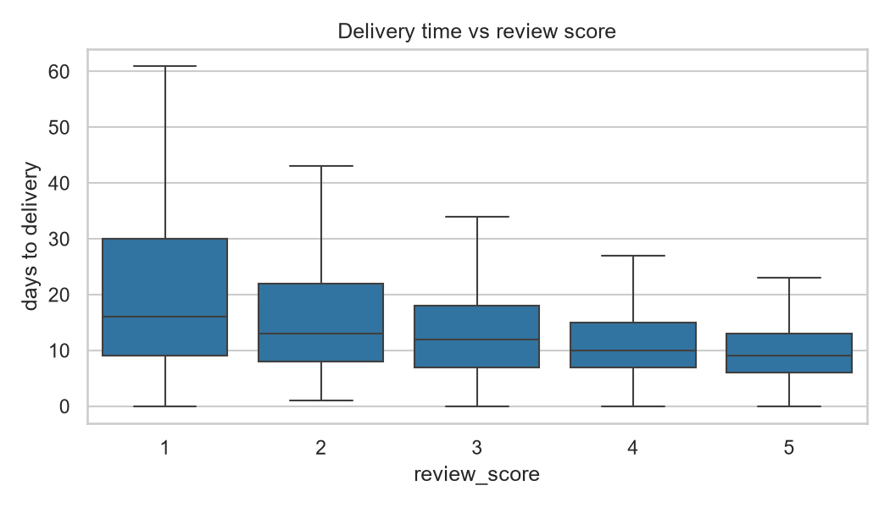
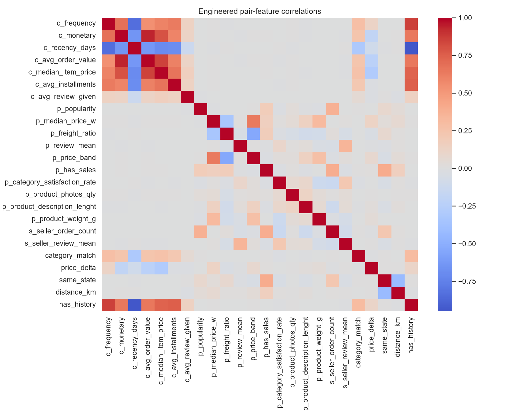
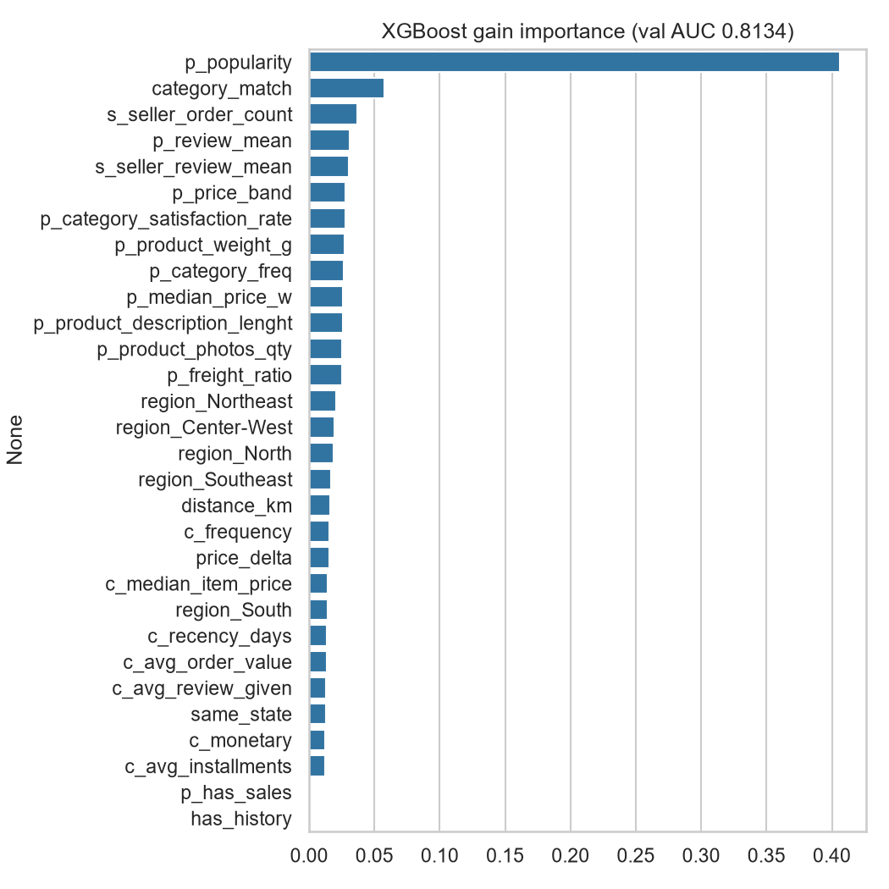
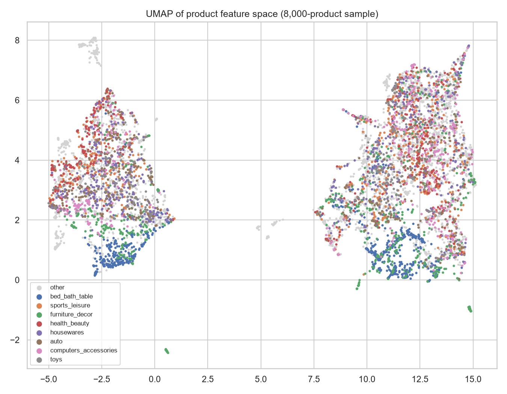
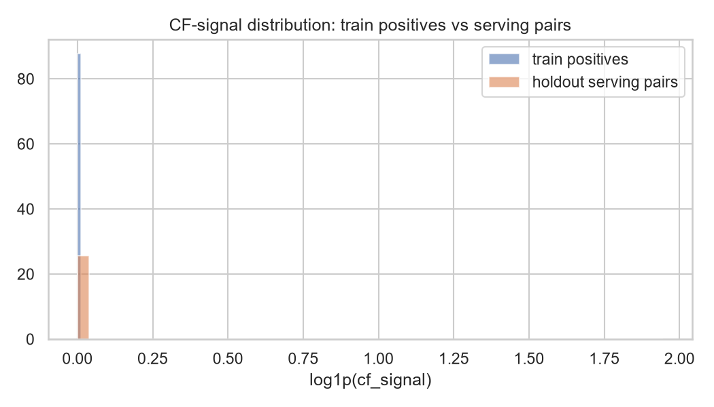

# Product Recommendation for the Olist Marketplace — Capstone Final Report

**Daniel Jethro Monzada** — Post Graduate Diploma in Artificial Intelligence and Machine Learning (AIM/Emeritus, June 2025 cohort)

*(Report written incrementally as each step lands. Steps 3–9 sections follow as the work completes.)*

---

## Step 1: Problem Understanding & Framing

Olist is a Brazilian marketplace that connects small sellers to big storefronts. When I profiled the data, one number ended up shaping the whole project: 96.9% of Olist's 96,096 customers have placed exactly one order, ever. That's a brutal retention picture, and it means the business question isn't "how do we rank products a bit better" — it's whether a recommender can pull more customers into a second purchase at all, and whether it can widen what buyers see beyond the same bestsellers. There's a seller-side angle too. Olist's pitch to small merchants is exposure, so a recommender that only ever surfaces the popular stuff quietly breaks the marketplace's own value proposition.

Task-wise this is a recommendation problem, but I've deliberately decomposed it into two stages, because that's how production recommenders actually work and because each stage answers a different question. Stage one is candidate generation: given a customer, produce a shortlist of plausible products using item-item collaborative filtering, content similarity, matrix factorization, and a popularity baseline that I fully expect to be hard to beat on data this sparse. Stage two is a supervised ranker, a binary classifier scoring "will this (customer, product) pair convert as a delivered purchase" over engineered features. I did consider simpler framings. Plain classification or customer clustering would've been easier to build, but neither delivers a ranked product list, which is the thing a marketplace actually needs. The two-stage split also has a practical modelling payoff: the ranker is a feature-based model, which is where explainability tools like SHAP genuinely work.

For candidate generation I'm tracking HitRate and Recall at K = 10, 50 and 100, plus NDCG@10, MRR and catalogue coverage. Bootstrap confidence intervals on all of them. Hit rates over a 32,951-product catalogue will be tiny numbers, and I don't want to declare a winner based on noise. The ranker gets ROC-AUC, PR-AUC and F1. The caveat: those are computed against sampled negatives, so they compare rankers against each other and say nothing absolute. The decision-grade number is neither family alone; it's the end-to-end table showing whether the full two-stage pipeline beats candidate generation on HitRate@10 and NDCG@10 for held-out purchases.

On business KPIs, each cohort gets one number with a baseline taken from the profiling run. For the roughly 3% of customers with purchase history, the KPI is repeat-purchase rate, currently 3.12% (2,997 of 96,096 customers), and the offline proxy is the pipeline's HitRate@10 uplift over the popularity baseline on held-out repeat purchases. For the single-purchase majority the honest target isn't personalisation, it's first-purchase cross-sell, which I'll proxy with category-level HitRate@10 on first orders versus popularity. Seller-side exposure equity gets measured directly: the share of top-10 recommendation slots going to products outside the top sales decile. All three are offline proxies; confirming real uplift would need an A/B test, which an offline capstone can't run.

## Step 2: Data Collection & Understanding

I'm using the Brazilian E-Commerce Public Dataset by Olist ([kaggle.com/datasets/olistbr/brazilian-ecommerce](https://www.kaggle.com/datasets/olistbr/brazilian-ecommerce), CC BY-NC-SA 4.0): 99,441 real anonymised orders from 2016–2018 across nine relational tables covering orders, order items, customers, products, sellers, reviews, payments, geolocation, and a Portuguese-to-English category translation. I picked it over synthetic or ratings-style datasets because it's genuinely transactional. Actual prices, freight costs, delivery dates and 1-to-5 review scores give the feature engineering something to chew on. The trade-off I accepted going in: no customer demographics (which reshapes the fairness audit, more on that in Step 5) and extreme interaction sparsity.

The profiling notebook (`notebooks/01_data_overview.ipynb`) drove what I'd call the most important decision in the project: the evaluation window dates. Olist's monthly volume tells a clear story. A tiny pilot in late 2016 (329 orders, with November 2016 missing entirely), steady growth through 2017, a plateau around 6–7k orders a month in 2018, and then a cliff after August 2018 where volume collapses to 16 and then 4 orders. Everything outside 2017-01 to 2018-08 is unusable. The three-window scheme is pinned to those dates in `configs/windows.yaml`: features from 2017-01 to 2018-02, ranker training labels from 2018-03 to 2018-05, holdout from 2018-06 to 2018-08. Every aggregate feature downstream gets computed strictly inside the feature window.

The tables themselves are in decent shape, but not spotless, and a few quirks matter. `order_items` has one row per physical unit, so its 112,650 rows collapse to 101,987 unique customer–product pairs; anything building an interaction matrix has to dedupe first. The reviews table caught me out. `review_id` looks like a primary key but isn't: 789 values appear more than once (814 duplicate rows) and 547 orders carry more than one review. I keep only the latest review per order. Missingness looks interpretable, not alarming: 88% of reviews have no title and 59% no message because most customers simply don't write text, and the 3% of orders missing a delivery date are largely the undelivered ones. Prices are heavy-tailed. The median item costs about R$75 while the p99 sits near R$890 and the max at R$6,735, which is why I'll winsorise price-derived features later rather than let a handful of luxury items stretch every scale. Review scores skew happy: 77.1% are 4 or 5. And 97.0% of orders reached `delivered` status, so filtering to delivered orders costs almost nothing. Geographically the dataset is lopsided, with 68.6% of customer records in the Southeast and just 1.9% in the North, which directly triggers the minimum-group-size rules I set for the fairness audit. A quick semantic pass over the columns (the notebook prints a per-table breakdown) shows mostly ids, categoricals and timestamps; the numeric signal concentrates in order items (price, freight) and product attributes (weight, dimensions), and free text exists only in review comments.

The full data dictionary lives in [`docs/data_dictionary.md`](../docs/data_dictionary.md): every column across all nine files with types, missingness, units and allowed values. I'll be upfront about how it was made, since it doubles as my first Step 9 deliverable. I had Claude draft it from schema profiles computed directly from the CSVs (`src/llm_docs.py`, with the prompt and raw output preserved in `docs/llm/`), then verified it by hand against the data. The draft was honestly better than I expected, but the verification wasn't a formality — it confidently called `review_id` "unique," which is exactly the kind of plausible-sounding error you only catch by checking. That catch is now a documented correction in the dictionary itself, and the uniqueness check is printed in the notebook's output so the number is reproducible.

## Step 3: Data Preprocessing, Applied EDA & Feature Engineering

All the cleaning and feature logic lives in `src/features.py` with `notebooks/02_eda_feature_engineering.ipynb` driving it, and every rule prints what it dropped or imputed. Filtering to delivered orders removes 2,963 of 99,441. The review dedupe (latest answer per order) removes 551 rows. Collapsing `order_items`' unit rows gives 102,425 order lines, and the product table needed 610 missing categories set to `unknown` plus 1,838 attribute values median-imputed. None of it silently changes the data, which was the point of returning the counts from every function. The window discipline from Step 2 is enforced here, and it turned out to need one rule I hadn't planned: a feature-window *order* can carry a review written after the cutoff. 3,805 reviews (6.7% of those joined to feature-window orders) were created past the cutoff, some well into the label window, so every review-based aggregate filters on `review_creation_date` and the notebook's audit cell now asserts both purchase and review-creation timestamps. Removing them nudged the average review given from 4.13 up to 4.17, because late reviews skew negative. I caught this in review after first shipping it wrong, which is a decent argument for auditing every timestamp column rather than just the obvious one.

The feature set covers three levels. Customers get RFM (recency, frequency, monetary), spend profile, average review given, installment habits and a preferred category. On the product side it's feature-window popularity, winsorised median price, freight-to-price ratio, review mean, a price band and the physical attributes, while sellers just carry volume and review reputation. Pair features are where the domain thinking sits: category match, price delta against the customer's median spend, a same-state flag, and a customer-to-seller haversine distance computed from the zip-prefix centroid lookup. Geography is *not* window-filtered, and that's deliberate — a customer's address is known at serving time, and window-filtering it would have thrown away the distance feature for the 98% of customers without purchase history. Cold-start fills are pinned to feature-window statistics (max recency 424 days, review mean 4.17, median customer-seller distance 453 km) so a pair's features don't depend on which batch it happens to be scored in. I also had to reinterpret one planned feature. The plan called for "category conversion rate," but Olist has no view or impression data, so conversion is unobservable; I substituted category satisfaction rate (share of the category's reviews at 4+), which is measurable and captures a similar quality signal.

The EDA backs the feature choices with numbers I found genuinely convincing. Median delivery time is 9 days on 5-star orders and 16 days on 1-star ones, and the 8% of reviewed orders that arrive late average 2.57 stars against 4.29 for on-time. That single contrast justifies every freight and distance feature in the set. Repeat buyers (2.92% of feature-window customers) spend more in total (R$255 vs R$136) but less per order, and lean harder on installments. Category demand isn't geographically uniform either; bed_bath_table's share swings 9.4 percentage points between regions within the feature window, which matters later because a popularity-only recommender would push the Southeast's taste onto everyone. Prices needed taming: the p99 winsorisation cap lands at R$1,102 and touches 205 products, about 1%.

The correlation heatmap over the engineered features mostly shows what you'd expect — monetary and average order value at 0.94, spend measures moving together — but its most useful lesson is a warning. The strongest correlations in the matrix (recency × has_history at −0.94, frequency × has_history at 0.86) are structural artefacts of the cold-start fills, not behaviour: when 98% of pairs share the same fill values, the fills correlate with the indicator by construction. I'll need to keep that in mind when reading feature importances and SHAP values later, since "importance" on a fill-dominated feature is really importance of being cold.

For the selection pass I assembled a preliminary ranking task: 21,260 label-window purchases as positives, uniform-random negatives at 1:4, splits grouped by customer. The cold-start number came out even starker than the Step 1 profiling suggested — only 2.09% of these pairs belong to a customer with feature-window history. The consequences show up immediately in the embedded selection. The L1 path zeroes 13 of 30 features at C=0.01, XGBoost's gain ranking puts product popularity at 0.41 with nothing else above 0.06, and the drop set is dominated by the six customer behavioural features that are cold for 98% of pairs. Picking C deserves a note, because the obvious rule gives a strange answer: C=0.001 actually has the best validation AUC (0.7334), but it collapses the model to four popularity-dominated features, stranding the domain features I expect to matter once hard negatives exist. I went with C=0.01 as the sparsest setting that keeps every feature family represented, and since C was chosen on the same validation set as the check below, I treat this whole pass as a screen. Retraining after the drop moved logistic regression from 0.7240 to 0.7244 AUC and XGBoost from 0.8123 to 0.8146, so the removed features were dead weight at best. One caveat: with random negatives this task is popularity-easy, so the selection stays provisional until notebook 03 re-runs it with hard negatives from the candidate generators.

Dimensionality reduction rounds out the step. PCA on the 13 standardised product features needs 10 components to reach 90% variance, so the feature set isn't carrying much redundancy — good news for the trees, and a sign that dropping components would actually cost information. The UMAP projection of the same space (8,000-product sample) still shows visible category clustering, which is exactly the structure the content-based candidate generator will lean on. For encoding, I one-hot encoded the five regions, frequency-encoded the 71 categories, and put a StandardScaler inside the linear pipelines only, since tree splits don't care about monotone rescaling.

## Step 4: Model Implementation & Comparison

Five candidate generators went head to head under the leave-last-order-out protocol: each of the 2,789 repeat buyers' last orders held out, Stage-1 artefacts fitted on the remaining 96,883 usable-range purchases, 840 users reserved for tuning the SVD rank and hybrid weight, and the untouched 1,949 producing the comparison table. Since hit rates over a 32,951-product catalogue are tiny numbers, every headline metric carries a bootstrapped 95% CI and I only claim a winner where intervals separate. The table came out cleaner than I expected. The hybrid at w=0.25 tops HitRate@10 with 0.203 [0.184, 0.221], content-based follows at 0.171, and the rest trail far behind: item-item CF 0.055, SVD 0.048, popularity 0.031. The hybrid's separation from popularity, CF and SVD is decisive; against content the intervals graze each other, so the fair claim is "at least as good, plus better coverage."

Two honest observations shape how to read that table. First, repurchase drives it: 69% of content's hits and 62% of the hybrid's are products the customer had already bought, which the seen-item policy allows on purpose and the table reports in its own column. For repeat buyers, "you'll buy again what you bought before" turns out to be the single strongest signal on this dataset. Second, popularity wasn't the unbeatable baseline the recommender literature warns about, and the reason is exactly that repurchase channel, which popularity can't exploit. On the category-level view (a 71-way space with workable base rates), CF actually leads at 0.55 — it's better at guessing the *kind* of thing you'll buy than the exact product. Meanwhile the plan's prediction about SVD held: at ~1.1 interactions per user it hovers near popularity no matter the rank. And Olist's basket structure (1.06 items per order) leaves item-item CF with only 8,710 nonzero similarity pairs, which also kills the ranker's co-purchase feature — `cf_signal` is positive for 0.1% of training positives, a result the sanity plot documents rather than hides. The feature I designed as the creativity hook is, on this dataset, nearly dead. I kept it, flagged it, and let the models route around it.

The ranker task uses the pinned protocol: label-window purchases as training positives, holdout-window purchases for evaluation, and four negatives per positive, half drawn from the customer's own Stage-1 candidate list (regional popularity for the cold majority) and half uniform random. All three models were tuned with GroupKFold by customer from the grids in `configs/models.yaml`, and every run went to MLflow. XGBoost and random forest land in a statistical tie on the holdout (AUC 0.864 vs 0.865, PR-AUC 0.614 vs 0.619), both clearly ahead of logistic regression at 0.785. The random forest pays for its fit with a 0.945 training AUC, an overfitting gap I'll return to in Step 5. F1 thresholds were selected on training predictions only, and I'll repeat the standing caveat: these numbers compare rankers against each other under one sampling scheme; they aren't absolute performance claims.

The end-to-end table is where the pipeline decision actually gets made, because it's the only place candidate generation and re-ranking meet on one metric. For all 18,390 holdout customers: route (98.5% cold to regional popularity, 1.5% warm to hybrid top-50), re-rank with each model, keep ten, score against what they really bought. Re-ranking with XGBoost gives the best overall HitRate@10 at 0.0146 [0.0128, 0.0165] against 0.0122 [0.0105, 0.0139] for Stage-1 order alone, a +20% relative lift that I'd call directional rather than conclusive since the intervals still touch. Logistic regression re-ranking actively destroys value (0.0062), a nice concrete demonstration that a weak ranker is worse than no ranker. The most interesting wrinkle is the warm cohort: for the 277 customers with history, the raw hybrid ordering (0.0578) beats every re-ranker, XGBoost included (0.0325). The tempting move is to re-rank only the cold route, but choosing that *after* seeing this table would be fitting to my own evaluation, so it goes in the future-work list with the requirement of fresh validation. The final pipeline is hybrid candidates plus XGBoost re-ranking, with that caveat stated rather than buried.

On reproducibility and the rest of the rubric row: seeds are fixed at 42 throughout, the chosen configuration is written to `models/chosen_config.yaml`, all metrics land in `models/metrics.json`, artefacts (similarity matrix, content matrix, SVD factors, popularity vector, the three rankers) are saved under `models/` — the random forest squeaked under the repo size limit at 53 MB compressed — and every model run is logged to MLflow's local store. I considered a neural recommender (NCF-style) and decided against it: with ~1.1 interactions per user and a repurchase-dominated signal, the data can't feed a model whose whole advantage is learning interaction structure, and the SVD result is the empirical version of that argument. That reasoning, rather than a reflexive "deep learning is better," is the model-choice story I'd defend.
